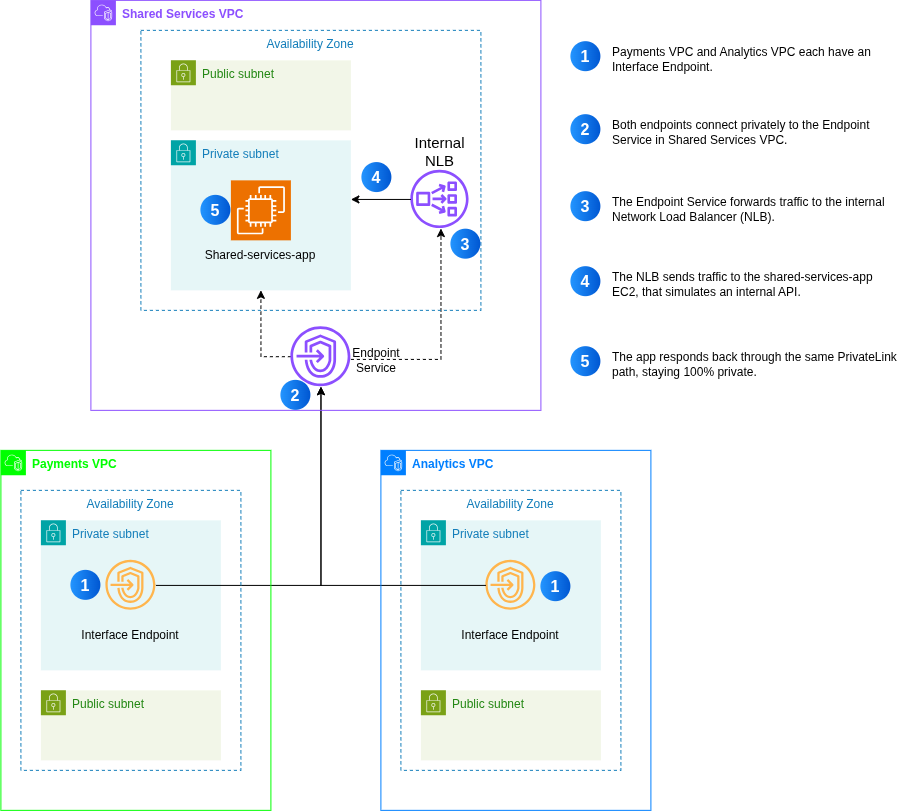
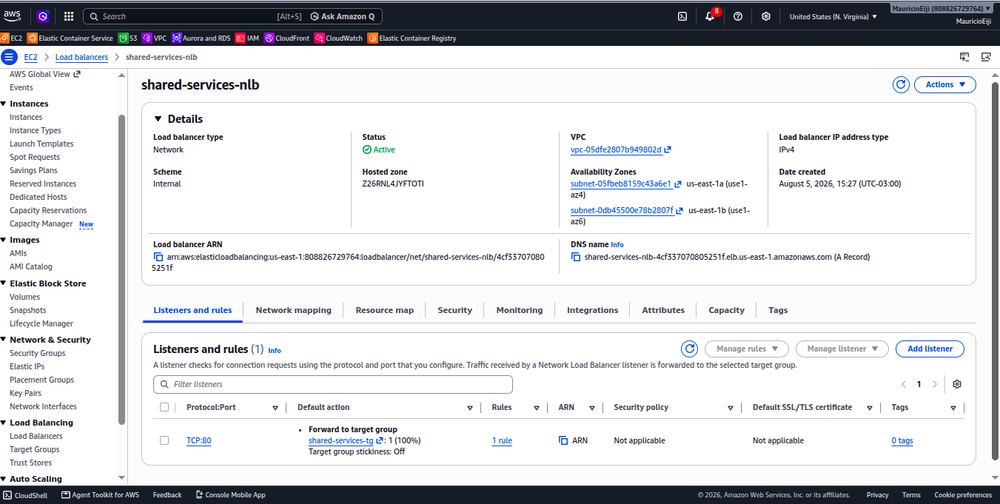
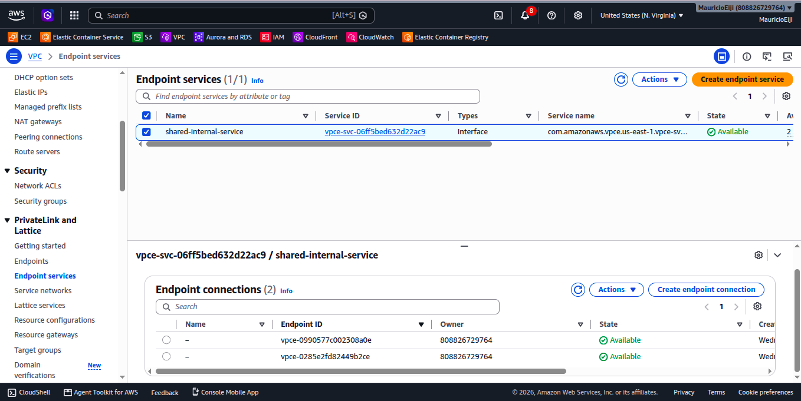
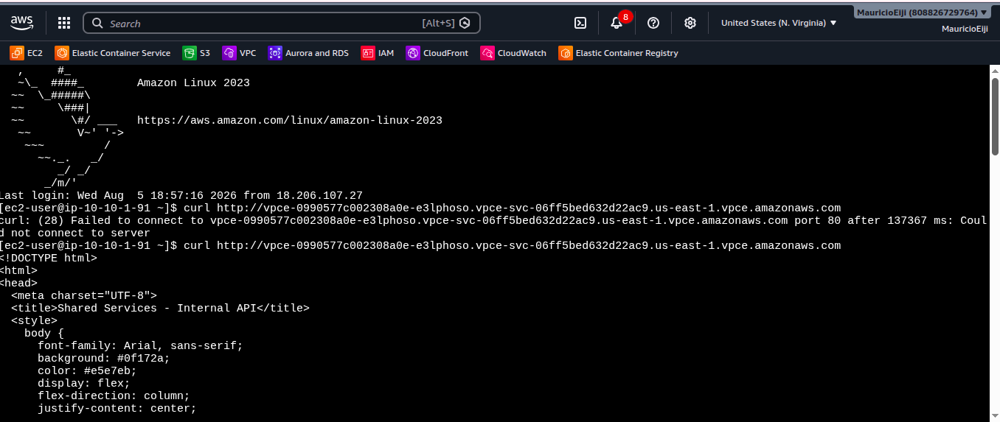

# Multi-VPC-Networking-and-PrivateLink-Architecture

This project demonstrates the implementation of a private multi-VPC connectivity architecture on AWS using **AWS PrivateLink, Network Load Balancer, VPC Endpoint Services, and Interface Endpoints**.

The architecture is based on a lab created by **Lucy Wang (Tech With Lucy)**. Beyond implementing the solution, my main goal was to understand the reasoning behind each architectural decision and how AWS PrivateLink enables secure service sharing between isolated VPCs.

# Business Problem

A growing fintech company operates multiple internal systems, including **Payments**, **Analytics**, and **Shared Services**. For security and compliance, each system is isolated within its own VPC. However, as teams increasingly depend on shared internal APIs, this isolation makes secure cross-VPC communication more challenging.

The company needs a way to allow applications to consume shared services without:

- Exposing internal services to the public internet
- Creating complex VPC peering connections
- Providing direct network connectivity between isolated environments
- Opening public endpoints or SSH access to backend services

The objective of this project is to design and implement a private connectivity model that allows authorized VPCs to consume shared internal services while maintaining network isolation and least-privilege access.

# Solution Overview

The solution uses **AWS PrivateLink** to expose the Shared Services application as a private service without creating direct network connectivity between the VPCs.

The architecture consists of:

- Three isolated VPCs
- Shared Services internal application
- Internal Network Load Balancer
- VPC Endpoint Service
- Interface Endpoints in Payments and Analytics
- Security Groups controlling network access

The Shared Services VPC acts as the **provider**, exposing the internal application through an Endpoint Service backed by the NLB. Payments and Analytics act as **consumers**, accessing the service through Interface Endpoints created inside their respective VPCs.

This allows the shared service to be consumed privately through AWS's internal network without requiring VPC peering, NAT, or public endpoints.

# Architecture

The following diagram illustrates the high-level architecture of the multi-VPC PrivateLink solution, highlighting how the Shared Services VPC exposes its internal application and how the Payments and Analytics VPCs securely consume the service through Interface Endpoints.

  
  

# Implementation

## VPCs, Subnets and Routing

The project begins with three independent VPCs representing the Payments, Analytics, and Shared Services environments.

Each VPC contains the required networking components, including:

- Public and private subnets
- Route Tables
- Internet Gateway

Public subnets are associated with Route Tables containing a route to the Internet Gateway.

Private subnets are also associated with Route Tables, but without a direct route to the Internet Gateway.

This routing configuration determines whether a subnet is considered public or private.

## Security Groups

Security Groups were configured to control access to the applications and client resources.

- Shared Services

  The Shared Services application allows HTTP traffic on port 80 from the private `10.0.0.0/8` address range.
  
  The source is restricted to private IP addresses rather than allowing HTTP access from the public internet.

- Payments

  The Payments client Security Group allows SSH access from resources associated with the same Security Group.

  Using a Security Group as the source allows access based on Security Group membership rather than relying on fixed IP addresses.

- Analytics

  The Analytics Security Group does not require inbound access because the client only needs to initiate connections to consume the shared service.

## Shared Services Application

The internal application is deployed on an Amazon EC2 instance inside a **private subnet** of the Shared Services VPC.

The instance does not have a public IP address because the application is intended to be consumed exclusively through private connectivity.

The application represents an internal API or platform service that could provide capabilities such as:

- Billing
- Identity
- Logging
- Internal APIs
- Centralized services

The service is intentionally not exposed directly to the public internet.

## Network Load Balancer

The Shared Services application is registered behind an **internal Network Load Balancer**.

The NLB provides the private entry point that will later be exposed through AWS PrivateLink.

The load balancer is configured as internal rather than internet-facing because the application must remain inaccessible from the public internet.

The NLB also provides the Layer 4 connectivity required by the PrivateLink Endpoint Service architecture.

  

## VPC Endpoint Service

The internal NLB is used to create a **VPC Endpoint Service**, representing the provider side of the PrivateLink architecture.

The Endpoint Service publishes the Shared Services application so that other VPCs can consume it without requiring direct connectivity to the Shared Services VPC.

The Endpoint Service generates a service name that consumers use when creating their Interface Endpoints.

The provider can also control which consumers are allowed to establish connections to the service.

## Interface Endpoints

Payments and Analytics consume the Shared Services application through **Interface Endpoints** created inside their respective VPCs.

Interface Endpoints create private network interfaces inside the consumer VPC, providing a private entry point to the Endpoint Service.

The resulting architecture is:

Payments VPC → Interface Endpoint → AWS PrivateLink → Endpoint Service → Internal NLB → Shared Services EC2

The same pattern is used by the Analytics VPC.

The Endpoint Service connections are approved on the provider side, allowing the Shared Services environment to control which VPCs can consume the service.

## PrivateLink Connectivity

AWS PrivateLink provides the private connectivity between the consumer Interface Endpoints and the provider Endpoint Service.

The important distinction is that the consumer VPC does **not** gain direct network connectivity to the Shared Services VPC.

Instead, it receives access to the specific service published through PrivateLink.

This provides service-level connectivity while preserving isolation between the underlying networks.

  

## Validation

The architecture was validated directly from an EC2 instance inside the Payments VPC.

First, attempting to access the internal NLB directly does not work because the Payments VPC has no direct network connectivity to the Shared Services VPC.

The connection fails.

The same service can then be accessed through the Interface Endpoint, and the request successfully returns the Shared Services application.

  

This demonstrates that the application remains inaccessible through direct cross-VPC connectivity while still being available to authorized consumers through AWS PrivateLink.

# Troubleshooting

During implementation, the Shared Services EC2 instance initially failed the NLB health check and remained **Unhealthy**.

To isolate the problem, a temporary EC2 instance was deployed with the same User Data in a public subnet and registered with the same Target Group. The instance became **Healthy**, confirming that the NLB, Target Group, and health check configuration were working correctly.

The issue was traced to the original EC2 running in a fully isolated private subnet without a NAT Gateway. The User Data script depended on downloading Apache from the Amazon Linux repositories, but the instance had no outbound connectivity to retrieve the required packages.

As a result:

Private EC2 → Package installation fails → Apache is not installed → Application does not respond → NLB Health Check fails

After resolving the backend issue, the PrivateLink connection still did not work.

Further investigation showed that the **Interface Endpoint Security Group only allowed SSH traffic** and did not allow HTTP traffic from the Payments client.

Adding an inbound rule for HTTP on port 80 from the Payments Security Group resolved the issue.

This troubleshooting process reinforced the importance of validating connectivity layer by layer, from the application and NLB to the Endpoint Service, Interface Endpoint, and Security Groups.

# What I Learned

This project strengthened my understanding of how **AWS PrivateLink enables private service sharing between isolated VPCs** without creating direct network connectivity between them.

One of the key takeaways was understanding that **public and private subnets are determined by routing**. A subnet becomes public when its associated Route Table contains a route to an Internet Gateway, while private subnets do not have a direct route to the Internet Gateway.

I also learned how PrivateLink separates the **provider and consumer sides**. The Shared Services VPC publishes its internal service through an **Endpoint Service backed by an internal Network Load Balancer**, while Payments and Analytics consume it through **Interface Endpoints**, which create private network interfaces inside their VPCs.

Another important insight was understanding that **PrivateLink shares a service, not an entire network**. The Payments VPC could not access the Shared Services NLB directly because there was no connectivity between the VPCs, but it could consume the specific service through its Interface Endpoint.

Finally, I learned how **Security Groups and Endpoint configuration work together** to control access to private services. The provider controls which consumers can establish connections to the Endpoint Service, while the Interface Endpoint's Security Group controls which resources inside the consumer VPC can access the endpoint.

# Final Thoughts

This project reinforced an important lesson: effective cloud architectures don't start with AWS services, they start with a business problem.

In this case, the objective was to allow isolated VPCs to securely consume shared internal services without exposing them to the public internet or creating unnecessary network connectivity. Every design decision, from PrivateLink and the internal NLB to the Endpoint Service and Interface Endpoints, was driven by that goal.

# Acknowledgements

This project is based on the AWS lab created by **Lucy Wang (Tech With Lucy)**.

The implementation, documentation, architectural analysis, and technical explanations presented in this repository reflect my own understanding and learning throughout the project.
